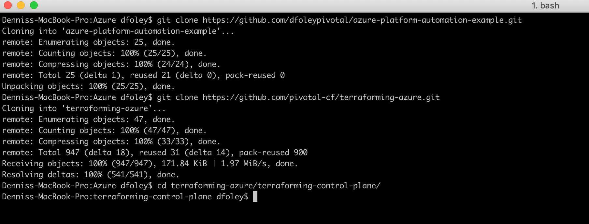
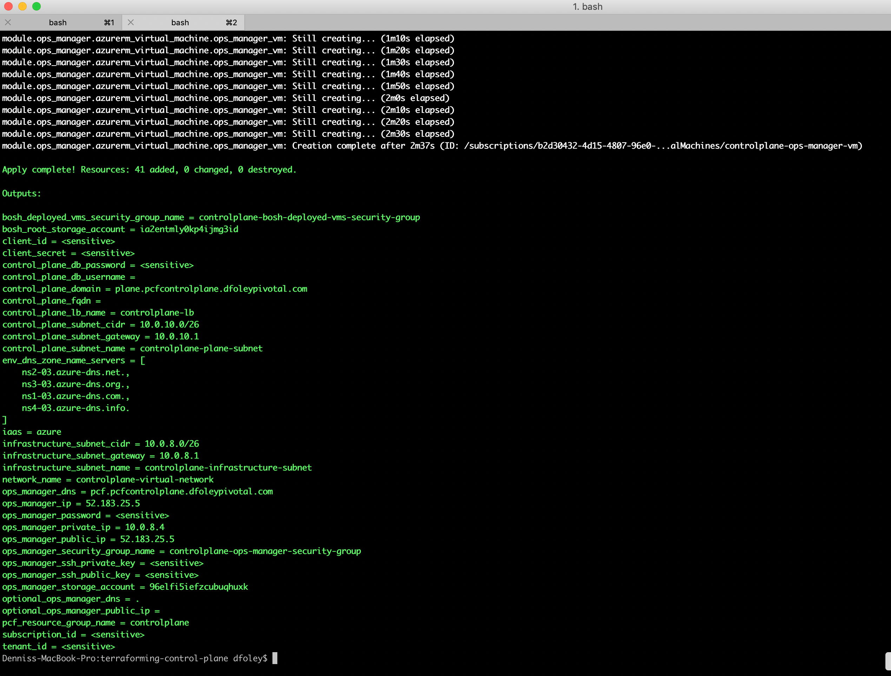
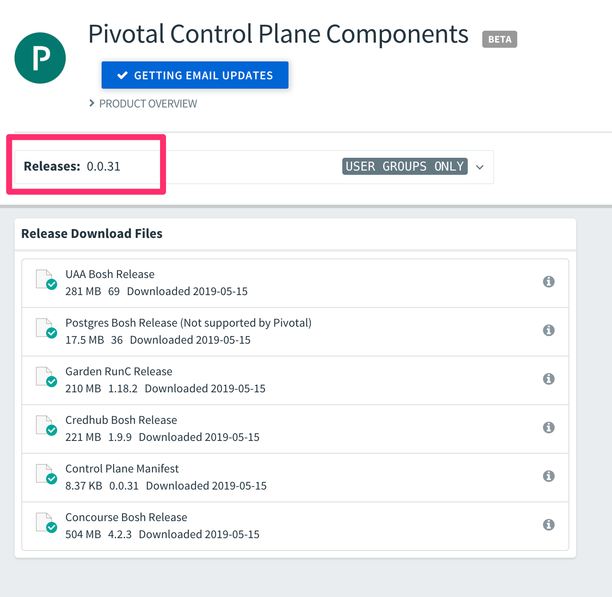

  
Update: May 9, 2019

## Introduction

This workshop will walk you through the process of deploying **Pivotal Cloud Foundry (PCF)** on **Microsoft Azure**. We will stand up **Concourse** using **Pivotal Control Plane** and deploy PCF using **Platform Automation**.

***To log issues***, click here to go to the [github](https://github.com/dfoleypivotal/azure-platform-automation-example/issues) repository issue submission form.

## Objectives

- [Install Pivotal Control Plane](#install)

## Required Artifacts

- The following lab requires a Microsoft Azure account.
- A registered domain name is required to deploy PCF.

<a id="install"></a>

## Install Pivotal Control Plane

### **STEP 1**: Clone Terraform template repository

- Open a terminal window and change to working directory. For documentation working directory location will be /Users/dfoley/development/Azure.

```bash
cd /Users/dfoley/development/Azure
```

- Clone workshop repository

```bash
git clone https://github.com/dfoleypivotal/azure-platform-automation-example.git
```

- Clone terraforming-azure repository

```bash
git clone https://github.com/dfoleypivotal/terraforming-azure.git
cd terraforming-azure/terraforming-control-plane/
```



### **STEP 2**: Create an Automation Account

- First, find your account by running the following commands using the [Azure CLI](https://docs.microsoft.com/en-us/cli/azure/install-azure-cli?view=azure-cli-latest)

```bash
az login
az account list
```


**Note:** Copy **Id** an **Tenant Id** as these values will be used later in the lab.

- To create the automation account, you need **az-automation**. You can use brew or go to the [releases](https://github.com/genevieve/az-automation/releases) and get the necessary binary.

```bash
brew tap genevieve/tap
brew install az-automation
```


- Run the following command. Replace **some-account-id** with your **subscription id** and create a unique **identifier=uri**.

```bash
az-automation \
  --account some-account-id \
  --identifier-uri http://example.com \
  --display-name controlplane \
  --credential-output-file controlplane-credentials.tfvars
  ```


- If you want to verify that the service principal was create you can login to the Azure Console. Click **Azure Active Directory** then **App registrations** and you will see the new **controlplane** application was created.

    

### **STEP 3**: Pave IaaS using Terraform

- Next step

- Using the values from the file **controlplane-credentials.tfvars** populate the **terraform.tfvars** file with the content below.

```bash
subscription_id = "some-subscription-id"
tenant_id       = "some-tenant-id"
client_id       = "some-client-id"
client_secret   = "some-client-secret"

env_name              = "controlplane"
ops_manager_image_uri = "https://opsmanagerwestus.blob.core.windows.net/images/ops-manager-2.4-build.192.vhd"
location              = "WestUS2"
dns_suffix            = "domain.com"

dns_subdomain         = "pcfcontrolplane"
```

- Create Infrastructure 

```bash
terraform init
terraform apply
```



- Back on the Azure Console, you will see that a resource group named **controlplane** has been created and you can view all the resources that where created.

    

- Create an NS record on the parent DNS Zone with the records returned by the following. You can test 

```bash
terraform output env_dns_zone_name_servers
```


- Verify connectivity with the following command:

```bash
dig pcfcontrolplane.<your domain> NS +short
```


### **STEP 4**: Configure BOSH Director

- From any browser, access Ops Manger using URL defined by:

```bash
echo https://"$(terraform output ops_manager_dns)"
```


- Follow the Pivotal documentation [Configuring BOSH Director on Azure](https://docs.pivotal.io/pivotalcf/2-4/om/azure/config-manual.html)

**Note:** On the *Create Networks Page* only create one network, following the *infrastructure* network guide, and set the *Name* field to *control-plane-subnet*

- For automated configuration run script **deploy-om-director.sh**

```bash
../../azure-platform-automation-example/scripts/deploy-om-director.sh
```


### **STEP 5**: Deploy Control Plane via Manifest

- Retrieve the assets from [Pivotal Network](https://network.pivotal.io/). Download the manifest and all of the releases from [Pivotal Control Plane Components](https://network.pivotal.io/products/p-control-plane-components/#/releases/359492)

    

- Download the stemcell for the releases from [Stemcells for PCF](https://network.pivotal.io/products/stemcells-ubuntu-xenial#/releases/354816)

    


- Move downloaded files to current directory (it will make it easier to upload the assets later)

```bash
cp ~/Downloads/{control-plane*.yml,uaa-release*.tgz,credhub-release*.tgz,postgres-release*.tgz,garden-runc*.tgz,concourse-release*.tgz,*bosh-stemcell*.tgz,bosh-dns*.tgz} .
```


- You need to upload each asset to your Ops Manager VM in order to upload them to BOSH. Save the Ops Manager SSH KEY to an environment variable (the ***OPS_MANAGER_KEY_PATH*** variable can be arbitrary)

```bash
export OPS_MANAGER_KEY_PATH=/your/ssh/key/path

terraform output ops_manager_ssh_private_key > $OPS_MANAGER_KEY_PATH
chmod 0600 $OPS_MANAGER_KEY_PATH
```


- Save the Ops Manager environment variables for connecting with the om CLI

```bash
export OM_TARGET="https://$(terraform output ops_manager_dns)"
export OM_USERNAME="admin"
export OM_PASSWORD="$(terraform output ops_manager_password)"
```


- Set environment variables for connecting to BOSH

```bash
eval "$(om --skip-ssl-validation bosh-env --ssh-private-key $OPS_MANAGER_KEY_PATH)"
```

- Upload the assets to BOSH

```bash
bosh upload-stemcell *bosh-stemcell*.tgz
bosh upload-release concourse-release-*.tgz
bosh upload-release credhub-release-*.tgz
bosh upload-release garden-runc-release-*.tgz
bosh upload-release postgres-release-*.tgz
bosh upload-release uaa-release-*.tgz
bosh upload-release bosh-dns-*.tgz
```


- Add a custom vm extension that includes details of your IAAS specific load balancer configuration.

- Create a vars file called **vm-extension-vars.yml** with the following content:

```vi
---
"control-plane-lb": controlplane-lb
```

- Create a config file called **vm-extension.yml**:

```vi
vm-extension-config:
  name: control-plane-lb
  cloud_properties:
   load_balancer: ((control-plane-lb))
```

- Create and apply the custom extension with om

```bash
om --skip-ssl-validation create-vm-extension \
  --config vm-extension.yml \
  --vars-file vm-extension-vars.yml

om --skip-ssl-validation apply-changes
```


- Retrieve the Control Plane domain and availability zones from Terraform.

```bash
export CONTROL_PLANE_ROOT_DOMAIN="$(terraform output control_plane_domain)"
```

- Make a **bosh-vars.yml** to hold these deployment vars:

```vi
---
external_url: https://plane.pcfcontrolplane.<your domain>
persistent_disk_type: 10240
vm_type: Standard_DS2_v2
azs: ["null"]
network_name: control-plane
wildcard_domain: "*.pcfcontrolplane.<your domain>"
uaa_url: https://uaa.pcfcontrolplane.<your domain>
uaa_ca_cert: |
  $(credhub get -n /p-bosh/control-plane/control-plane-tls -k certificate | awk ‘{printf “%s\r\n  “, $0}’)
 ```

- Deploy the manifest from the Ops Manager VM

```bash
bosh deploy -d control-plane control-plane-*.yml \
  --vars-file=./bosh-vars.yml
```


